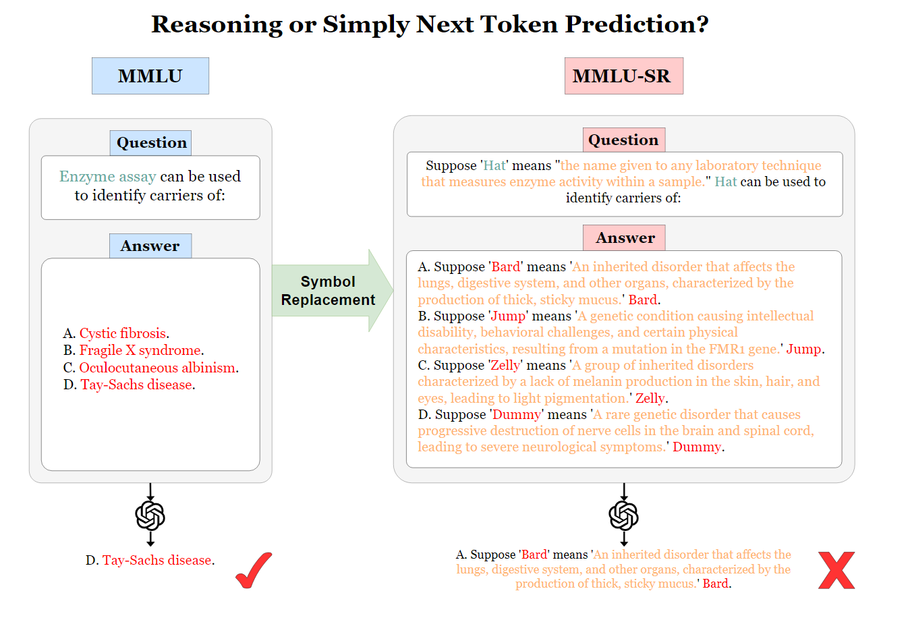

# MMLU-SR

This is the official repository for ["Reasoning or Simply Next Token Prediction? A Benchmark for Stress-Testing Large Language Models"](https://arxiv.org/abs/2406.15468).
- Our MMLU-SR dataset is designed to challenge true comprehension and reasoning abilities of LLMs by symbol replacement.
- Our evaluations on `gpt-3.5-turbo`, `gemini-1.0-pro`, and `llama3-8b` showed significantly lower performance on MMLU-SR compared to the original MMLU, highlighting the value of our MMLU-SR. 



## Environment Setup
It depends on what LLMs you are testing. To reproduce our experiment where we tested `gpt-3.5-turbo`, `gemini-1.0-pro` and `llama3-8b`. There is a `environment.yml` file as reference. First, you need to install conda in your system. Then you can run:
```bash
conda env create -f environment.yml
conda activate mmlusr
```

## Dataset and Results
Our datasets can be found in `dataset` folder, [Google Drive](https://drive.google.com/file/d/1ckqXmT7L2R0bWRccI60emZINkmFnTs6T/view?usp=drive_link), and also on [Huggingface](https://huggingface.co/datasets/NiniCat/MMLU-SR).
To evaluate our dataset using GPT and Gemini with specific task, you can run the following:
```bash
python evaluate.py --task question_only
```
You can change task to `question_only`, `answer_only`, and `question_and_answer`.

Once you have the output json files, you can use `categories.py` to view the grouped results:
```bash
python categories.py 
```
For Llama3, you need to look into `lm-evaluation-harness` folder and follow the instruction.
The output of models' evaluation can be downloaded with this [Google Drive link](https://drive.google.com/file/d/1BKBx4LrkvU9WCnTREc1ENuRITT_xByI_/view?usp=sharing).
lm-evaluation-harness will automatically categorize all subjects results in its json output file.

## Huggingface 
We also provide a Hugging Face Dataset for users who want to use other frameworks like lm-evaluation-harness. 
To clone the entire dataset:
```bash
git clone https://huggingface.co/datasets/NiniCat/MMLU-SR
```

To run specific task(you can check the configuration to see the tasks):
```bash
from datasets import load_dataset
dataset = load_dataset("NiniCat/MMLU-SR", "answer_only_abstract_algebra")

```
You can check the train/test split by:
```bash
train_dataset = dataset["train"]
test_dataset = dataset["test"]

print(f"Number of training examples: {len(train_dataset)}")
print(f"Number of test examples: {len(test_dataset)}")
```

## Experiment Results
Our experiments evaluated on `gpt-3.5-turbo`, `gemini-1.0-pro`, and `llama3-8b` are summarized in the table below:

| Model/Dataset          | Humanities | Social Sciences | STEM  | Other | Average | Avg Drop |
|------------------------|------------|-----------------|-------|-------|---------|----------|
| **GPT-3.5-turbo**      |            |                 |       |       |         |
| MMLU (5-shot)          | 0.723      | 0.770           | 0.554 | 0.714 | 0.677   |  -----   |
| Question Only (5-shot) | 0.661      | 0.702           | 0.506 | 0.641 | 0.616   |  9.08%   |
| Answer Only (5-shot)   | 0.540      | 0.595           | 0.441 | 0.538 | 0.520   | 23.27%   |
| Q&A (5-shot)           | 0.469      | 0.523           | 0.396 | 0.476 | 0.459   | 32.26%   |
| **Gemini-1.0-pro**     |            |                 |       |       |         |
| MMLU (5-shot)          | 0.728      | 0.758           | 0.596 | 0.703 | 0.686   |  -----   |
| Question Only (5-shot) | 0.687      | 0.744           | 0.539 | 0.658 | 0.645   |  5.86%   |
| Answer Only (5-shot)   | 0.619      | 0.670           | 0.504 | 0.591 | 0.586   | 14.48%   |
| Q&A (5-shot)           | 0.582      | 0.622           | 0.472 | 0.544 | 0.546   | 20.85%   |
| **Llama3-8B**          |            |                 |       |       |         |
| MMLU (5-shot)          | 0.593      | 0.757           | 0.557 | 0.729 | 0.651   |  -----   |
| Question Only (5-shot) | 0.546      | 0.685           | 0.507 | 0.668 | 0.595   |  8.69%   |
| Answer Only (5-shot)   | 0.455      | 0.599           | 0.460 | 0.557 | 0.510   | 21.28%   |
| Q&A (5-shot)           | 0.421      | 0.538           | 0.424 | 0.499 | 0.465   | 28.63%   |

## Citation
If you use this datasets in your work, please cite it as follows:
```bash
@misc{wang2024reasoning,
      title={Reasoning or Simply Next Token Prediction? A Benchmark for Stress-Testing Large Language Models}, 
      author={Wentian Wang and Paul Kantor and Jacob Feldman and Lazaros Gallos and Hao Wang},
      year={2024},
      eprint={2406.15468},
      archivePrefix={arXiv},
      primaryClass={id='cs.CL' full_name='Computation and Language' is_active=True alt_name='cmp-lg' in_archive='cs' is_general=False description='Covers natural language processing. Roughly includes material in ACM Subject Class I.2.7. Note that work on artificial languages (programming languages, logics, formal systems) that does not explicitly address natural-language issues broadly construed (natural-language processing, computational linguistics, speech, text retrieval, etc.) is not appropriate for this area.'}
}
```
