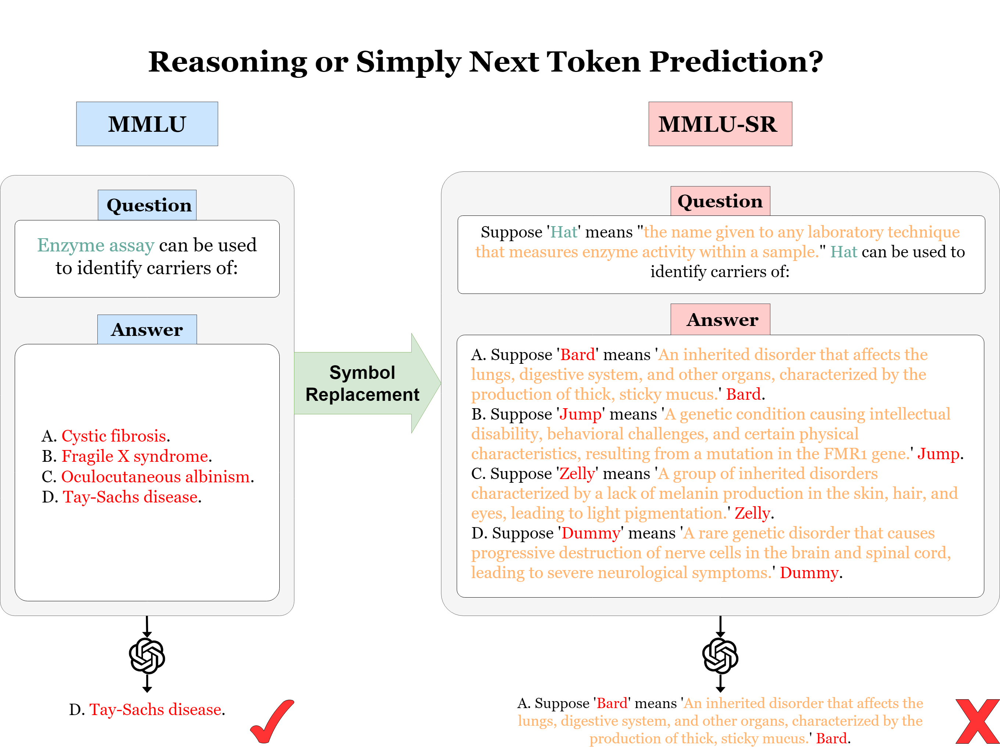

# MMLU-SR: NIPS Dataset Track 2024

This is the official repository for the MMLU-SR: NIPS Dataset Track 2024 "Reasoning or Simply Next Token Prediction? A Benchmark for Stress-Testing Large Language Models".



## Dataset and Results
We wrapped our results and dataset in a single MMLU-SR zip file. To reproduce our results, you can run the following:

```bash
python run_experiment.py --model_name <model_name> --dataset_path <path_to_dataset>
```

## Huggingface 
We also provide a Hugging Face Dataset for users who want to use other frameworks like lm-evaluation-harness. Simply do:
```bash
from datasets import load_dataset
dataset = load_dataset("NiniCat/MMLU-SR")
```

## Results
Our results evaluated on gpt-3.5-turbo, gemini-1.0-pro, and llama3-8b are summarized in the table below:
Model	Humanities	Social Sciences	STEM	Other	Average
GPT-3.5-turbo					
MMLU (5-shot)	0.723	0.770	0.554	0.714	0.677
Question Only (5-shot)	0.661	0.702	0.506	0.641	0.616
Answer Only (5-shot)	0.540	0.595	0.441	0.538	0.520
Q&A (5-shot)	0.469	0.523	0.396	0.476	0.459
Gemini-1.0-pro					
MMLU (5-shot)	0.728	0.758	0.596	0.703	0.686
Question Only (5-shot)	0.687	0.744	0.539	0.658	0.645
Answer Only (5-shot)	0.619	0.670	0.504	0.591	0.586
Q&A (5-shot)	0.582	0.622	0.472	0.544	0.546
Llama3-8B					
MMLU (5-shot)	0.593	0.757	0.557	0.729	0.651
Question Only (5-shot)	0.546	0.685	0.507	0.668	0.595
Answer Only (5-shot)	0.455	0.599	0.460	0.557	0.510
Q&A (5-shot)	0.421	0.538	0.424	0.499	0.465
